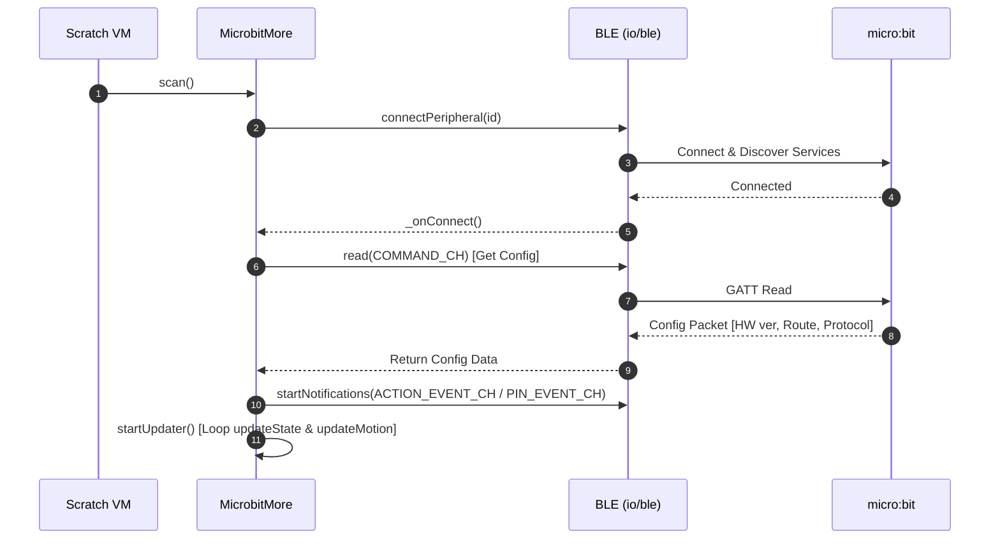
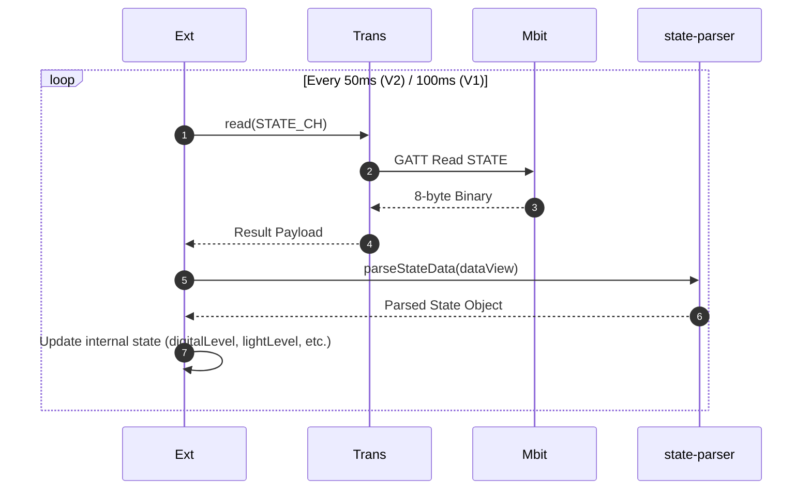

# Microbit More v2 Internal Design Specification

## Overview

This document defines the overall architecture, component composition, data flows, and inter-module design specifications for the **mbit-more-v2** extension.

---

## Architecture

```
┌─────────────────────────────────────────────────────────────┐
│                      Scratch 3.0 VM                         │
└──────────────────────────────┬──────────────────────────────┘
                               │ opcode / arguments
                               ▼
┌─────────────────────────────────────────────────────────────┐
│                    MicrobitMoreBlocks                       │
│             (src/vm/extensions/block/index.js)               │
└──────────────────────────────┬──────────────────────────────┘
                               │ delegates
                               ▼
┌─────────────────────────────────────────────────────────────┐
│                        MicrobitMore                         │
│         (src/vm/extensions/block/microbit-more.js)          │
│ - State management (sensor values, pin values, button states) │
│ - Communication orchestration & send queue management       │
└───────┬──────────────────────┬──────────────────────┬───────┘
        │ parse                │ encode               │ I/O
        ▼                      ▼                      ▼
┌──────────────┐       ┌──────────────┐       ┌──────────────┐
│   parsers/   │       │   encoders/  │       │  BLE / Serial│
│ state-parser │       │ command-     │       │ ble.js       │
│ motion-parser│       │ encoder      │       │ serial-web.js│
│ event-parser │       │              │       │              │
└──────────────┘       └──────────────┘       └──────────────┘
```

---

## Key Component Roles

### 1. `MicrobitMoreBlocks` (`index.js`)
- **Role**: Bridge interface to Scratch VM.
- **Functionality**:
  - Provides block definitions, arguments, and dropdown menus to Scratch via `getInfo()`.
  - Extracts parameters when block opcodes are executed and delegates calls to `MicrobitMore` instance methods.

### 2. `MicrobitMore` (`microbit-more.js`)
- **Role**: Logical state management and communication orchestration for micro:bit.
- **Functionality**:
  - Periodically polls sensor values using `updateState()` and `updateMotion()`.
  - Asynchronously receives in-band notifications and dispatches state via `onNotify()`.
  - Manages outgoing command queue and enforces rate limits (BLE: 30ms, Serial: 100ms) via `sendCommand()`.
  - Delegates binary data processing to pure function modules (`parsers/` and `encoders/`).

### 3. `parsers/` (Pure Binary Decoding Functions)
- **`state-parser.js`**: Extracts GPIO levels, button states, light level, temperature, and sound level from 8-byte `STATE_CH` packets.
- **`motion-parser.js`**: Extracts pitch, roll, 3-axis acceleration, compass heading, and 3-axis magnetic force from 20-byte `MOTION_CH` packets.
- **`event-parser.js`**: Extracts event types and timestamps from 20-byte `ACTION_EVENT` / `PIN_EVENT` notification packets.

### 4. `encoders/` (Pure Command Encoding Functions)
- **`command-encoder.js`**: Assembles binary packets for text display, LED matrix rendering, and pin mode configuration.

---

## Key Sequence Diagrams

### 1. Connection Establishment & Initialization Sequence



### 2. Sensor Polling & Data Update Sequence



---

## Error Handling & Recovery Design

1. **BLE Connection Timeout**
   - If data reception stops for 4500ms or longer, the `resetConnectionTimeout` timer fires and calls `handleDisconnectError` to safely transition to a disconnected state.
2. **Corrupted & Short Packets**
   - Each `parsers/` function checks array length and `dataView.byteLength` upfront, returning `null` on invalid payloads to prevent corrupting internal state (defensive design).
